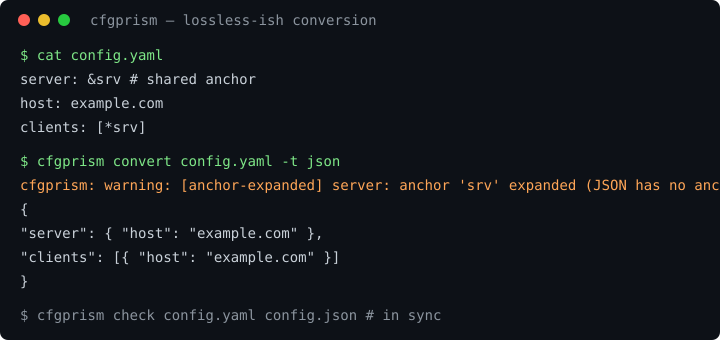

# cfgprism

A config converter between formats **without silent losses**: it preserves
comments, key order and formatting wherever the target format can express
them, and warns explicitly wherever loss is unavoidable.

> Status: **Stage 6 — DX and growth — done.** `cfgprism check` for sync
> checks, composite GitHub Action + pre-commit hook, cargo-dist releases
> (5 targets + homebrew/scoop/npm scaffolding), issue/PR templates.
> Architecture and parser choices: [`docs/DESIGN.md`](docs/DESIGN.md);
> decision log: [`docs/DECISIONS.md`](docs/DECISIONS.md); adding more:
> [`CONTRIBUTING.md`](CONTRIBUTING.md).



## Web demo

<https://ilyaosovskoi.github.io/cfgprism/> — two panes, format selects,
warnings, and a “Copy as link” button (state in the URL hash). Same engine
as the CLI, compiled to WebAssembly; everything runs in the browser, no
backend. Sources: [`web/`](web/).

## Install

```sh
cargo install cfgprism            # crates.io (after first release)
brew install ilyaosovskoi/tap/cfgprism   # macOS/Linux (after first release)
scoop bucket add cfgprism https://github.com/ilyaosovskoi/scoop-bucket  # Windows (planned)
npx cfgprism --version            # npm wrapper (downloads the native binary)
```

From source (works today, no network at runtime):

```sh
cargo install --git https://github.com/ilyaosovskoi/cfgprism.git --locked
```

## Why not yq / dasel

| | yq | dasel | cfgprism |
|---|---|---|---|
| Comments on conversion | silently dropped (`-o=json`) | discarded on input (man page says so) | preserved, else `Warning` on stderr |
| Key order | may be re-sorted | not guaranteed | always preserved |
| YAML anchors → JSON/TOML | expanded silently | expanded silently | expanded + `AnchorExpanded` |
| `--strict` (warning → error) | no | no | yes |
| Config sync check | no | no | `cfgprism check` + Action + pre-commit hook |
| Scope | jq-style querying | unified selectors | conversion fidelity only |

## Conversion matrix

Same-format pairs round-trip byte-identically. Cross pairs emit canonical
output plus warnings; `E` = precise error when the target cannot represent
the input (never silent loss).

| from \\ to | json | jsonc | json5 | toml | yaml | dotenv | ini |
|---|---|---|---|---|---|---|---|
| json | = | ✓ | ✓ | ✓ | ✓ | flat¹ | 1-level¹ |
| jsonc | ✓² | = | ✓ | ✓ | ✓ | flat¹ | 1-level¹ |
| json5 | ✓² | ✓ | = | ✓ | ✓ | flat¹ | 1-level¹ |
| toml | ✓³ | ✓³ | ✓³ | = | ✓ | flat¹ | 1-level¹ |
| yaml | ✓²⁴ | ✓⁴ | ✓⁴ | ✓⁴ | = | flat¹ | 1-level¹ |
| dotenv | ✓⁵ | ✓⁵ | ✓⁵ | ✓⁵ | ✓⁵ | = | ✓⁵ |
| ini | ✓⁵ | ✓⁵ | ✓⁵ | ✓ | ✓⁵ | E⁶ | = |

¹ Nesting into dotenv, deep nesting/arrays into INI are precise errors
(`nested values have no … representation`). Flat scalars stringify.
² Comments dropped with `CommentDropped` (strict JSON only).
³ Datetimes coerce to strings with `TypeCoerced`.
⁴ Anchors expand with `AnchorExpanded`; `<<` merges splice silently.
⁵ Untyped ends: everything is text (order and keys preserved).
⁶ dotenv→ini with nesting is an error (flat only).
Plus: `null`→toml is an error; order violations→toml/ini warn
`KeyReordered`; duplicate keys collapse last-wins with a warning on strict
targets only. `--strict` turns any warning into a hard error.

## Stage-5 formats (all pairs convert-or-error via the same rules)

| target | mapping | notes |
|---|---|---|
| hcl | attrs for scalars/lists, blocks for nested maps | expressions/heredocs are parse errors; `${…}` literal |
| properties | flat string map | like dotenv; `\uXXXX`, continuations |
| kdl | nodes + args/props/children | nested arrays unrepresentable (precise error); canonical layout |
| ron | structs/maps/lists | struct names drop (see D17); comments hoist; canonical layout |

The 7×7 matrix suite covers the level-1+YAML core; stage-5 pairs are
covered by golden fixtures, unit tests and adversarial cases.

## Why not yq / dasel

| | yq | dasel | cfgprism (plan) |
|---|---|---|---|
| Comments on conversion | silently dropped (`-o=json`) | discarded on input (man page says so) | preserved, else `Warning` on stderr |
| Key order | may be re-sorted | not guaranteed | always preserved |
| YAML anchors → JSON/TOML | expanded silently | expanded silently | expanded + `AnchorExpanded` |
| `--strict` (warning → error) | no | no | yes |

## Install / build

```sh
cargo build -p cfgprism
./target/debug/cfgprism formats
```

No network calls at runtime; one static binary.

## Usage

```sh
# Convert file (source format guessed from extension)
cfgprism convert config.toml -t json -o out.json

# Explicit source format, stdin, stdout
cat config.json | cfgprism convert -f json -t jsonc

# Any warning becomes a hard error
cfgprism convert config.toml -t toml --strict

# Verify mirrored configs carry the same data (exit 1 on mismatch)
cfgprism check config/app.json config/app.toml
cfgprism check --unordered a.toml b.json

# Supported formats: json jsonc json5 toml yaml dotenv ini hcl properties kdl ron
cfgprism formats
```

Warnings always go to stderr; converted text goes to stdout (or `-o` file).

## Keeping mirrored configs in sync (CI)

GitHub Action (`uses: ilyaosovskoi/cfgprism/action`, see `action/action.yml`):

```yaml
- uses: ilyaosovskoi/cfgprism/action@v0
  with:
    files: config/app.json config/app.toml
```

pre-commit hook (see `.pre-commit-hooks.yaml`):

```yaml
repos:
  - repo: https://github.com/ilyaosovskoi/cfgprism
    rev: v0.1.0
    hooks:
      - id: cfgprism-sync
        args: [config/app.json, config/app.toml]
```

## Project layout

```text
crates/cfgprism-core     — IR (Node/Doc/Trivia/Style/Span), Format trait, warnings, errors
crates/cfgprism-formats  — json/jsonc/json5 (lossless engine), toml
                         (toml_edit adapter), yaml (saphyr events +
                         own trivia), dotenv, ini, hcl + properties
                         (own parsers), kdl, ron
crates/cfgprism-cli      — `cfgprism` binary (clap)
crates/cfgprism-wasm     — wasm-bindgen wrapper (skeleton; full web demo in stage 7)
tests/fixtures/<format>  — golden files (*.in + *.out)
docs/DESIGN.md           — architecture + parser research
docs/DECISIONS.md        — decision log (append-only)
```

## Stage plan

- [x] Stage 0. Reconnaissance: `docs/DESIGN.md`, `docs/DECISIONS.md`
- [x] Stage 1. Skeleton: workspace, CI, IR, `trait Format`, CLI
- [x] Stage 2. JSON, JSONC/JSON5, TOML, `.env`, INI (byte round-trip)
- [x] Stage 3. YAML (subset + flow + Norway tests)
- [x] Stage 4. Cross-conversion, full pair matrix, bench + fuzz
- [x] Stage 5. HCL, Properties, KDL, RON
- [x] Stage 6. DX, releases, sync checks
- [x] Stage 7. Web demo (WASM + GitHub Pages)
- [ ] Stage 6. DX and growth (README/GIF, CONTRIBUTING, templates, releases)
- [ ] Stage 7. Web demo (WASM + GitHub Pages)

## Quality bars (enforced from stage 1)

- No `unwrap()` in library code (CI job `no-unwrap-in-lib`; tests may use it).
- Every parse error carries `line:col`.
- `cargo fmt --check`, `cargo clippy --all-targets -- -D warnings`,
  `cargo test` on linux/macOS/Windows (GitHub Actions).
- Golden fixtures (`tests/fixtures/<fmt>/*.in|*.out`) + property tests
  (`parse → emit → parse` equivalence, emit idempotence).
- Public library API documented with doc-tests.

## License

MIT (`LICENSE-MIT`). Runtime dependencies are MIT/Apache-2.0 dual-licensed
except `kdl` (Apache-2.0); see `cargo license`-style audit in CI (planned).
